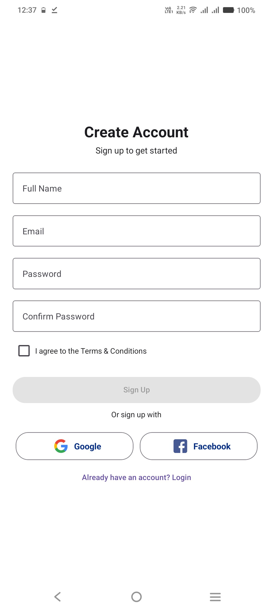
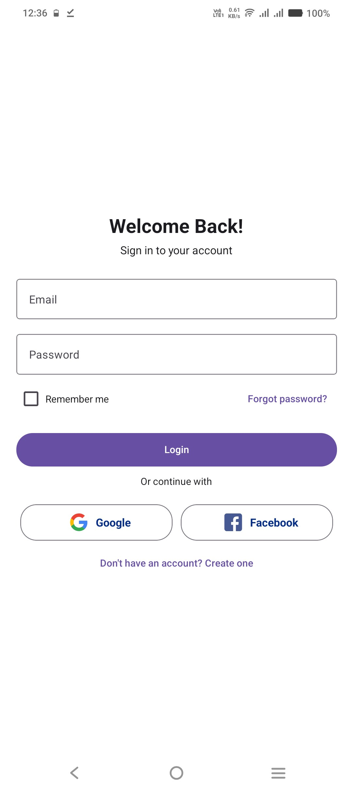
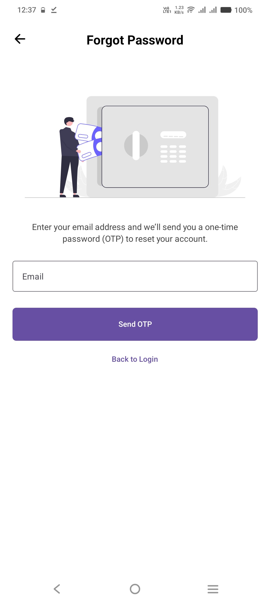
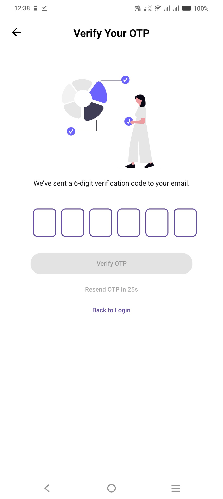
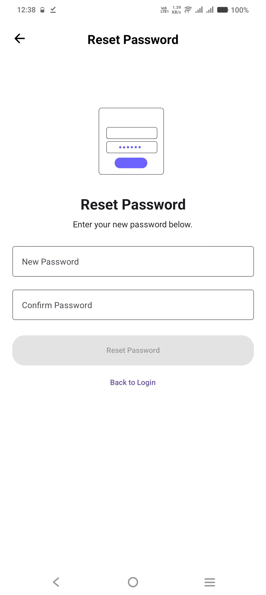
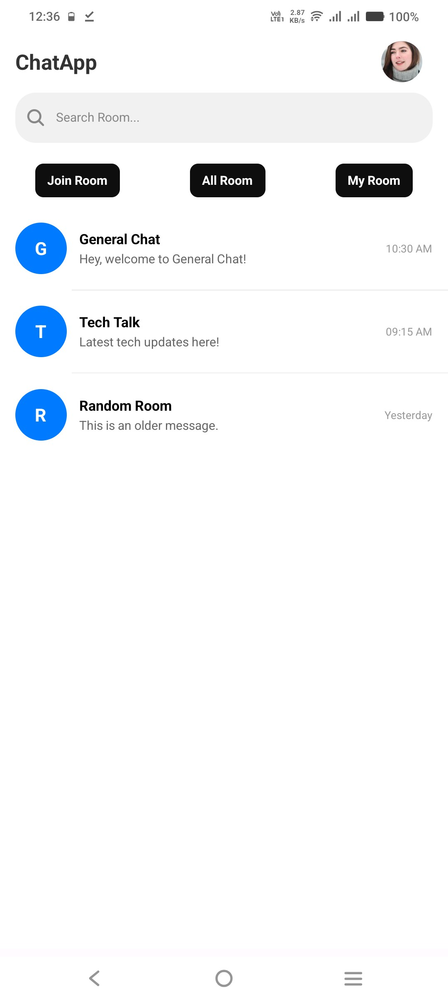
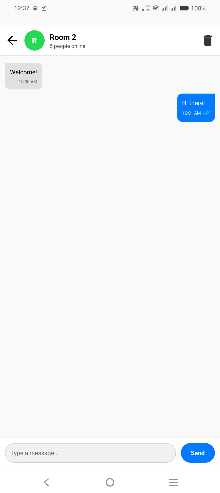
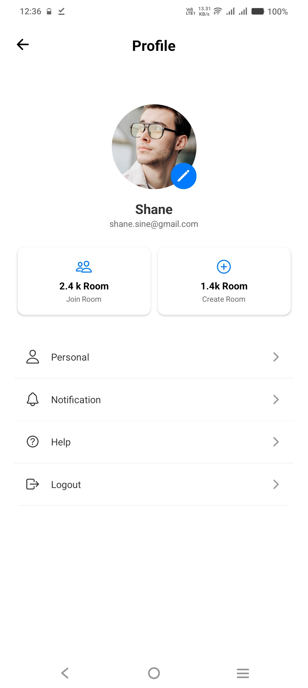
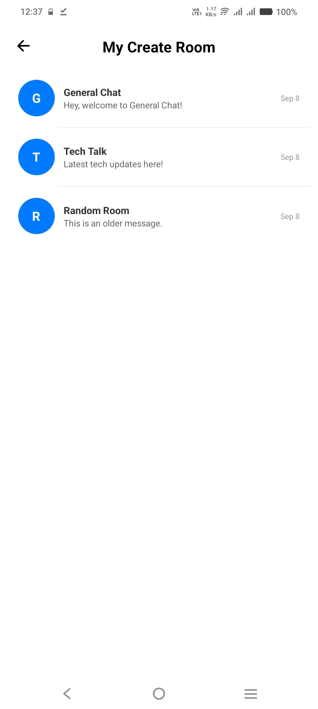
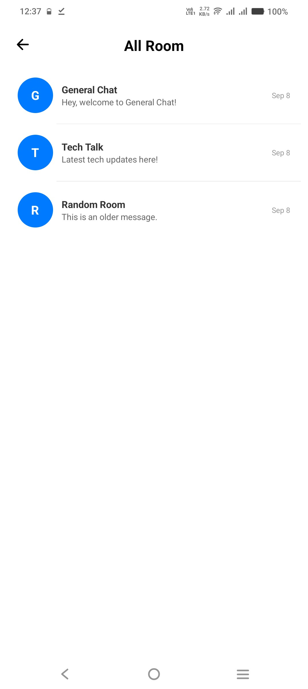

# Room Chat App (Frontend Only)

This is the **frontend of the Room Chat App** built using **React Native and Expo**.  
This version **does not connect to a backend**, so messages are only stored locally in the app state.

---

## Features

- Real-time chat UI simulation (messages stored locally)
- Message input with send button
- Message bubbles for **me** and **other**
- Timestamps for each message
- Delivered / sent indicators for sent messages
- Scrollable chat with auto-scroll to latest message
- Keyboard-aware input field
- Chat header with room name, online users, and delete all messages option

---

## Tech Stack

- **React Native**  
- **Expo**  
- **React Hooks** (`useState`, `useEffect`, `useRef`)  
- **React Native Paper** (optional styling components)  
- **React Navigation** (for screen routing)  
- **MaterialIcons** (for icons)

---

## Screens

1. **Chat Screen**  
   - Main chat interface with messages and input field
   - Local message simulation with sent/delivered status
2. **Header Component**  
   - Room name display
   - Online user count
   - Delete messages button

---

## Getting Started

### Prerequisites

- Node.js >= 16
- npm or yarn
- Expo CLI (`npm install -g expo-cli`) or use `npx expo`

### Installation

1. Clone the repository:
```bash
git clone https://github.com/sohit-mishra/RoomChatingApp.git
cd RoomChatingApp
```

2. Install dependencies:
```
npm install
# or
yarn install
```


3. Start the Expo development server:
```
npx expo start
```
4. Run the app on an emulator or physical device:
- Use Expo Go app for iOS/Android
- Scan the QR code from Expo CLI

## Screenshots

### Signup Screen


### Login Screen


### Forgot Password Screen


### OTP Verification Screen


### Reset Password Screen


### Home Screen


### Chat Room Screen


### Profile Screen


### Join Room Screen


### My Created Rooms Screen


### All Rooms Screen



### Author

#### Sohit Mishra
- GitHub: https://github.com/sohit-mishra


---

If you want, I can also **add instructions for building the APK and submitting it**, so the README fully covers your project submission.  

Do you want me to do that?
